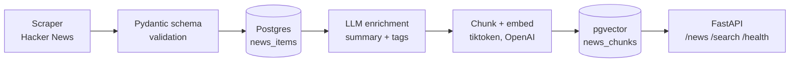

# AI News Search

An end-to-end AI engineering pipeline: live web scraping in, an LLM-enriched and embedded database out, semantic search served over a REST API — built to practice the full path from raw scraped data to a production-deployed, cloud-hosted system.

🔗 Live API: https://ai-news-api-104487450523.us-central1.run.app/docs

## What this project shows

| Layer | What it demonstrates |
|---|---|
| Scraping & validation | Live Hacker News scraping, article extraction, normalized into a strict Pydantic schema — bad data rejected at the boundary, not discovered downstream |
| Structured LLM output | OpenAI's structured output (not free-text parsing) for article summarization and tagging, validated against a Pydantic model before it ever reaches storage |
| Semantic search (RAG-lite) | Articles chunked, embedded (`text-embedding-3-small`), and indexed in Postgres via `pgvector`; search ranks results by vector similarity, not keyword matching |
| Cloud deployment | Containerized with Docker, deployed as a Cloud Run **Service** (the live API) and a separate Cloud Run **Job** (the batch pipeline), with credentials in Secret Manager and a hosted Postgres database on Supabase |
| Automation | Cloud Scheduler triggers the batch pipeline weekly — no manual runs required |

## Architecture

```

```

Each stage only trusts data the previous stage already validated — a scraper change never touches the database layer, and a database change never touches the API layer.

## The semantic search layer

The core technical piece: `/search` doesn't do keyword matching. A query gets embedded into a 1536-dimension vector, and Postgres (via `pgvector`'s HNSW index) returns the chunks whose embeddings are closest by inner product — so a search for `"AI safety"` can surface an article that never uses those exact words, as long as it's talking about the same underlying concept.

Built manually rather than through a framework like LangChain — the tokenization, chunking (`tiktoken`, 500-token windows), embedding, and vector-index logic are all hand-written and understood end to end, not abstracted behind a library call.

## Real bugs, found and fixed

- **A trailing newline byte in a Secret Manager secret** silently corrupted the production database connection string (`postgres` became `postgres\n`, a nonexistent database) — traced through Cloud Run logs to the exact byte, not just the surface `500` error, and fixed by controlling the exact bytes written rather than trusting copy-paste.
- **A DNS resolution failure on Supabase's direct connection** from the local dev environment — resolved by switching to Supabase's session pooler connection, the officially recommended alternative for networks where direct IPv6 resolution fails.
- **An IAM propagation delay** caused the first Cloud Scheduler trigger to fail silently before the grant had synced — confirmed via execution logs rather than assumed, and Scheduler's own retry logic recovered once permissions caught up.
- **Row Level Security was disabled by default** on the Postgres tables, flagged by Supabase's security scanner as critical (any client holding the project's public API key could read or write the tables directly, bypassing the API entirely) — closed by enabling RLS with no policies, denying all access through Supabase's public API while leaving the app's own database connection unaffected, since it authenticates as the table owner, a role Postgres exempts from RLS by default.

## Known limitations

- Single data source (Hacker News) — the scraper interface supports adding OpenAI, Anthropic, and YouTube as sources, but they aren't implemented yet.
- No rate limiting or authentication on `/search` — each call costs a real OpenAI embedding request, so the public endpoint currently has no abuse protection.
- No automated tests yet — correctness has been verified manually and via production logs, not a test suite.
- No frontend yet — the API is fully functional but only usable via `/docs` (Swagger UI) or direct HTTP calls; a Streamlit interface is in progress.

## Run it locally

```bash
git clone https://github.com/abhiwalia33/Semantic-news-pipeline.git
cd Semantic-news-pipeline
uv sync
cp .env.example .env   # fill in OPENAI_API_KEY and DATABASE_URL
docker compose up -d   # starts local Postgres with pgvector
uv run python -m app.database.create_tables
uv run python -m app.pipeline          # scrape, enrich, index
uv run uvicorn app.main:app --reload --port 8001
```

Then visit `http://localhost:8001/docs`.

## Tech stack

Python · FastAPI · SQLAlchemy · PostgreSQL + pgvector · OpenAI API (structured output, embeddings) · Docker · Google Cloud Run · Google Secret Manager · Google Cloud Scheduler · Supabase

## Project structure

```
app/
  scrapers/     # source-specific scrapers -> NewsItem
  schemas/      # shared Pydantic models (NewsItem, ArticleEnrichment, SearchResult)
  agents/       # LLM calls: enrichment (structured output), embeddings
  database/     # SQLAlchemy models, connection, repository (all DB access isolated here)
  services/     # orchestration: ingestion, enrichment, indexing
  api/routes/   # FastAPI endpoints: news, search, health
  pipeline.py   # batch entry point (ingestion -> enrichment -> indexing)
  main.py       # FastAPI app
Dockerfile
```
